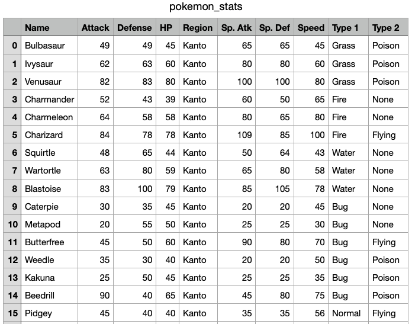
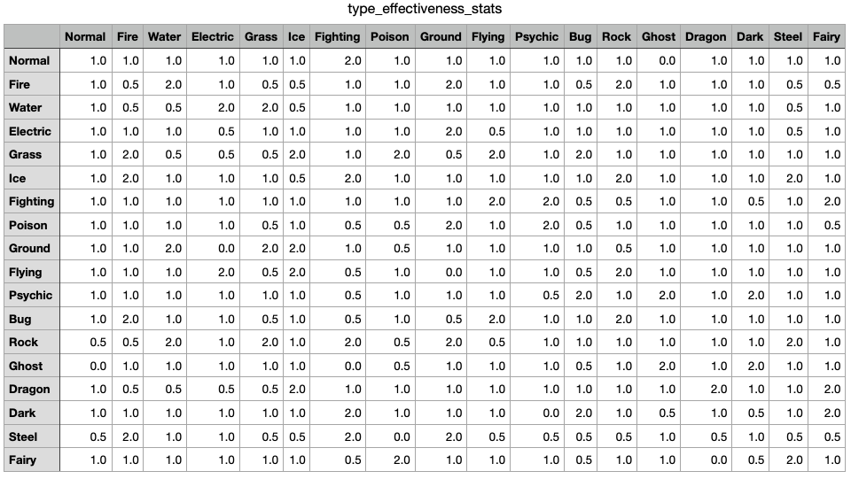
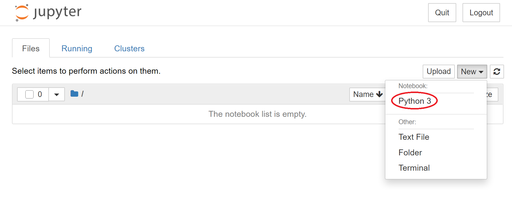

# Lab 4: Conditional Statements and Pokémon API

In P4, you will be playing with some Pokémon and you will simulate simple Pokémon battles using conditional statements. In Lab P4, you will learn to use `project.py`, which you will need to complete P4. You will also be introduced to some simple conditional statements and 'helper functions' which will be useful for P4.

<h2> Corrections/Clarifications
</h2>

None yet. 

**Find any issues?** Report to us: 

- Abhay Punjabi <apunjabi@wisc.edu>
- Brian Huang <thuang273@wisc.edu>

## Learning the API

First click [`project.py`](https://github.com/msyamkumar/cs220-s21-projects/blob/master/lab-p4/project.py), [`pokemon_stats.csv`](https://github.com/msyamkumar/cs220-s21-projects/blob/master/lab-p4/pokemon_stats.csv), and [`type_effectiveness_stats.csv`](https://github.com/msyamkumar/cs220-s21-projects/blob/master/lab-p4/type_effectiveness_stats.csv) and download them to a `lab4` directory. If you found your `.csv` files are downloaded as `.txt` files (e.g. `pokemon_stats.txt` instead of `pokemon_stats.csv`), run `mv pokemon_stats.txt pokemon_stats.csv` to change the type of the file into `.csv` file manually. Here `mv` is a shell command to rename or move files. All the data that we need for P4 is stored in `pokemon_stats.csv` and `type_effectiveness_stats.csv`. 

Open `pokemon_stats.csv` with Microsoft Excel or any other Spreadsheet software first, and take a look at it. You will see a list of Pokémon along with certain statistics for each of those Pokémon.



Each Pokémon comes from a certain 'Region', and has one or two 'Types'. A Pokémon with only one Type has 'None' as its value for 'Type 2'. Moreover, each Pokémon has six other statistics, namely:

1. HP (short for Hit Points)
2. Attack (short for Physical Attack)
3. Defense (short for Physical Defense)
4. Sp. Atk (short for Special Attack)
5. Sp. Def (short for Special Defense)
6. Speed (which is self explanatory)

Next, open `type_effectiveness_stats.csv` with Microsoft Excel or any other Spreadsheet software, and take a look at it. You will see a table of Pokémons' types. Rows represent the type of attacker, and columns represent the type of defender.



All Pokémon creatures and their moves are assigned certain types. Each type has several strengths and weaknesses in both attack and defense. In battle, you should use Pokémon and moves that have a type advantage over your opponent; doing so will cause much more damage than normal. There are 18 types in this table. Taking the second row (Fire) and the third column (Water) as an example, since attacker in "Fire" type is stronger than defender in "Water" type, the damage from attacker to defender can be double.

If you are feeling brave, take a look at [`gen_csv.ipynb`](https://github.com/msyamkumar/cs220-s21-projects/blob/master/p4/gen_csv.ipynb) to see how these two files (`pokemon_stats.csv` and  `type_effectiveness_stats.csv`)  were generated. Don't worry if it doesn't make much sense at this point. By the end of CS220, you will be able to understand everything that is happening there. For now, you can try to figure out what is happening in each of the cells.

`project.py` is designed to give you access to the data in `pokemon_stats.csv` and `type_effectiveness_stats.csv`. First, we need to check the `project.py` API just like we did in P3. Enter the Python Interactive Mode and type:

```python
>>> import project
>>> dir(project)
['__builtins__', '__cached__', '__doc__', '__effectiveness__', '__file__', '__init__', '__loader__', '__name__', '__package__', '__pokemon__', '__spec__', 'get_attack', 'get_defense', 'get_hp', 'get_region', 'get_sp_atk', 'get_sp_def', 'get_speed', 'get_type1', 'get_type2', 'get_type_effectiveness', 'print_stats']
>>>
```

As you can see, there are eleven functions here that do not begin with two underscores. Read the documentation or play with them to figure out what they do. For instance, if you want to read the documentation for the function `print_stats`, type:

```python
>>> print(project.print_stats.__doc__)
```

If you want to see the function in action, try:
```python
>>> project.print_stats('Pikachu')
```

Similarly, experiment with the other ten functions inside `project.py`. Try the following:
1. `project.get_region('Squirtle')`
2. `project.get_type1('Pikachu')`
3. `project.get_type2('Bulbasaur')`
4. `project.get_hp('Dragonite')`
5. `project.get_attack('Charizard')`
6. `project.get_defense('Snorlax')`
7. `project.get_sp_atk('Infernape')`
8. `project.get_sp_def('Squirtle')`
9. `project.get_speed('Greninja')`
10. `project.get_type_effectiveness('Fire', 'Water')`

Once you are comfortable with the functions in `project.py` move to the next section.

## Introducing Conditional Statements

Create a new notebook inside the `lab4` directory and run the following code in a cell. When we say "notebook" we are referring to creating a new python3 jupyter notebook similar to previous labs/projects. A reminder of how to create a new one is shown below:



```python
import project

if project.get_region('Pikachu') == 'Kanto':
    print ('Kanto')
else:
    print('Not Kanto')
```

What is the output of this cell? If you change the name of the Pokémon from 'Pikachu' to 'Greninja', does the output change? What happens if you use a bad name (say 'CS220')?

In a new cell, run the following code:

```python
if project.get_hp('Snorlax') >= project.get_hp('Heracross'):
    print('Snorlax')
else:
    print('Heracross')
```

As you might expect, the above code checks the HP of both the Pokémon and prints the name of the Pokémon with the higher HP. In P4, you will regularly have to compare the stats of different Pokémon. So, it might be useful to create a function here. First, copy/paste the following code in a new cell.

```python
def compare_hp(pkmn1, pkmn2):
    if project.get_hp(???) >= project.get_hp(???):
        return ???
    else:
        return ???
```

You will have to replace the `???` with the appropriate variables. Such a function that performs a small task and can be used by other functions to perform more complicated tasks is called a 'helper function'. Let us create more helper functions, which will be useful for P4.

```python
def compare_attack(pkmn1, pkmn2):
    #TODO: Return the name of the Pokemon with the higher Attack stat
```

Please find the function which is used to get the attack of a Pokémon provided in project.py. Fill in the details of the function `compare_attack`. If you want, you can make more such helper functions.

We will now create another helper function which is slightly different from the ones we have seen so far.

```python
def get_total_attack(pkmn):
    return (project.get_attack(pkmn) + project.get_sp_atk(pkmn))
```

That function sums up the Attack and Special Attack stats of a given Pokémon and returns that value. Try creating a function that returns the sum total of all statistics for a given Pokémon. They might prove useful in P4.

```python
def get_stat_total(pkmn):
    #TODO: Return sum of all stats(HP,Attack,Defense,Sp. Atk,Sp. Def, Speed)
```

To verify that your functions are correct, check that `get_stat_total('Heracross')` returns 500.

## More Advanced Conditional Statements

So far, we have only used if statements to compare two numbers. Let us do something more fancy now. As you might have seen in the database, a Pokémon might have one or more types. For instance, Pikachu has just one type: Electric, whereas Charizard has two: Fire and Flying. Copy/paste the following code in a new cell.

```python
def get_num_types(pkmn):
    if project.get_type1(pkmn) == 'None':
        return 0
    elif project.get_type2(pkmn) == 'None':
        return 1
    else:
        return 2
```

Play with the function to understand what it is doing. Finally, let us create a function that checks if two Pokémon have the same types:


```python
def same_types(pkmn1, pkmn2):
    if project.get_type1(pkmn1) == project.get_type1(pkmn2):
        if project.get_type2(pkmn1) == project.get_type2(pkmn2):
            return True
    return False
```
So far, the function looks good, but there is something wrong with it. To see the problem, look at the output of the following cell:

```python
same_types('Dragonite', 'Noivern')
```

Look at the output of `project.print_stats('Dragonite')` and `project.print_stats('Noivern')` to see why it went wrong. Pokémon with the same types but in different orders should also be considered the same. We can add some code to account for this as shown below:

```python
def same_types(pkmn1, pkmn2):
    if project.get_type1(pkmn1) == project.get_type1(pkmn2):
        if project.get_type2(pkmn1) == project.get_type2(pkmn2):
            return True

    if project.get_type1(pkmn1) == project.get_type2(pkmn2):
        if project.get_type2(pkmn1) == project.get_type1(pkmn2):
            return True
            
    return False
```

At last. Taking the type effectiveness into consideration, here is a function to compare two types and see which one is stronger. Take a look at the output of `stronger_type("Fire", "Water")` or `stronger_type("Fire", "Grass")`. Besides, what if the type of attacker makes no effect to the defender? To find this answer, check out the output of `stronger_type("Bug", "Water")`.

```python
def stronger_type(type1, type2):
    type_1_effectiveness = project.get_type_effectiveness(type1, type2)
    type_2_effectiveness = project.get_type_effectiveness(type2, type1)
    if type_1_effectiveness > type_2_effectiveness:
        return type1 + " is stronger than " + type2
    elif type_1_effectiveness < type_2_effectiveness:
        return type2 + " is stronger than " + type1
    else:
        return "Draw"
```


## Good Coding Style for Functions

When we are trying to design a function, we want to make sure that only the latest version for that function exists in our code. For example, in the previous section, we introduce the original version for `same_types(pkmn1, pkmn2)`, where the conditional expressions need some modifications. Instead of copying and pasting the original function, what we could do is to make changes in the original function and rerun it. In this way, there won't be multiple `same_types(pkmn1, pkmn2)` functions and it is easier to maintain your code.

You can now get started with P4. You can use any helper function that you have created here in P4. Good luck and have fun!
